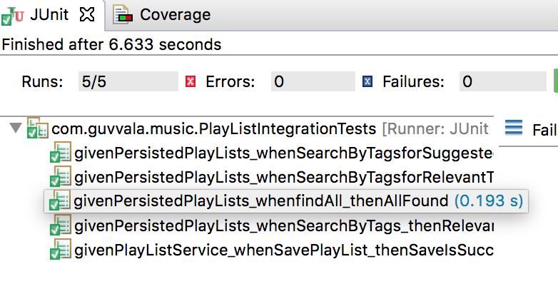
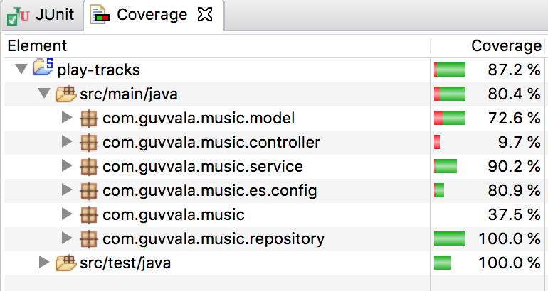

[](https://www.codacy.com/app/rsguvvala/playlists?utm_source=github.com&amp;utm_medium=referral&amp;utm_content=rsguvvala/playlists&amp;utm_campaign=Badge_Grade)       [](https://www.codacy.com/app/rsguvvala/playlists?utm_source=github.com&utm_medium=referral&utm_content=rsguvvala/playlists&utm_campaign=Badge_Coverage) [![SonarCloud Badge] (https://sonarcloud.io/api/project_badges/measure?project=rsguvvala_playlists&metric=alert_status)]

## Setup Instructions

### Prerequisites

#### Install Elasticsearch

Please follow [link](https://www.elastic.co/guide/en/elasticsearch/guide/master/running-elasticsearch.html) to setup elasticsearch.

Once the installation is complete, start the elastic search server as below

``` bash
cd elasticsearch-<version>
./bin/elasticsearch 
```

#### Install Kabana (Optional)

Please follow [instructions](https://www.elastic.co/guide/en/kibana/current/setup.html) to setup Kibana

### Start the API locally

#### Buid API

mvn clean install

#### Start the API

``` bash
java -jar target/play-tracks-0.0.1-SNAPSHOT.jar

Server starts on port 8877
```

## Demo & API Contract

API is hosted in AWS and available at demo [link](http://api.rvala.com/)

### Get All PlayLists

This end point displays Playlists in the descending orders of Views.
Also supports pagination

``` bash
curl http://api.rvala.com/music/playlists

```

### Get Playlists by Tag

This end point displays Playlists in the descending orders of Views.
Also supports pagination
``` bash
curl http://api.rvala.com/music/playlists/{tag}

```
### Auto Suggest tags based on the query(tag)

To get suggestions for the query "pop"
``` bash
curl http://api.rvala.com/music/playlists/suggestions?tag=pop

```

### Get Recommended tags 
These tags will be based on the appearance of the other tags along with the searched tag

To get recommended tags for "alternative"
``` bash
curl http://api.rvala.com/music/playlists/recommendations?tag=alternative

```

## Design

Only Delivery API is implemented as the focus of the problem is on Deivery

<p align="center">
  
</p>

## Tests & Coverage

Most of business logic is around Service Layer and Custom Repository layer. Following are the Tests focussing these 2 areas.
Code coverage is above 80% (Rest is mostly controller layer)

<p align="left">
  
  
</p>
